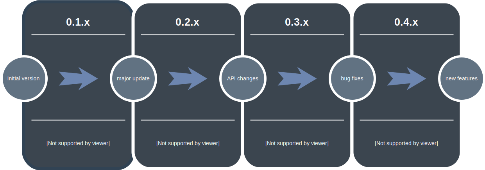

-
:video_game: Game jam Java framework based on [libgdx](https://libgdx.badlogicgames.com/).

[](https://travis-ci.org/bitbrain/braingdx)
[](https://search.maven.org/search?q=g:io.github.bitbrain%20AND%20a:braingdx-core&core=gav) [](http://bitbrain.github.io/braingdx/docs/latest/) [](https://codecov.io/gh/bitbrain/braingdx)
[](LICENSE.MD)

**:space_invader: [Features](#features) |**
**:package: [Installation](#installation) |**
**:green_book: [Documentation](https://github.com/bitbrain/braingdx/wiki) |**
**:beers: [Collaboration](#collaboration) |**
**:rocket: [License](#license) |**
**:pencil: [Changelog](CHANGELOG.md)**

---
# Motivation

> Another game development framework? Really?! 🤔

In Java world, we game developers already have [libgdx](https://libgdx.badlogicgames.com/) in order to create beautiful, feature-rich games. It allows us to be highly flexible how we design our game, however it is not ideal for small game jams. Especially in the first hours time is spent on wiring everything together, creating game object classes, setting up lighting, physics, tweening, writing shaders and particle management as well as sound manipulation. 

From experience, this can take several hours which is costly, especially on small 24 hour game jams. You could move away from Java and use a popular game engine instead, but we Java developers like it simple and we do *not* want to give up on Java! Alternatively, all the boilerplate work should be done for you - and this is where **braingdx** comes into play!

This framework does not replace [libgdx](https://libgdx.badlogicgames.com/) but gives your game superpowers!


# Features

This framework provides:

* **Scene transitions** how to switch between screens by applying different and custom animations
* **Tweening pipeline** Using [Universal Tween Engine](https://github.com/AurelienRibon/universal-tween-engine) to make the most of animations in a few lines.
* **World rendering pipeline** no more custom Java classes for game entities. *brainGDX* offers a way to add objects to a game world, handle physics, collision detection and updating out of the box.
* **Lighting** brainGDX comes with [Box2DLights](https://github.com/libgdx/box2dlights) under the hood. Apply and configure dynamic lighting even for your entities.
* **Physics** this framework has Box2D support out of the box!
* **Particles** a game is no game without proper particles. brainGDX comes with full particle support. Attach particles to entities, apply behaviors to particles or define particle fields and effects out of the box.
* **Parallaxing** beautiful parallax scrolling effects await you in this framework.
* **Scene shaders** apply different shaders like Bloom, Antialiasing or Vignette effects to your scenes.
* **3D audio support** apply 3D sound effects and set sound sources in your world. Additionally, apply sound sources to moving game objects, fade in between music etc.
* **Controller support for components** plug in your controller and go ahead. No more configuration hell!
* **Actor library (button menu, nameplates, tooltips)** ever wanted to write an RPG or just show little tooltips on the screen? brainGDX provides several UI components for your needs.
* **Extended Tiled Map support** Ever wanted to write a multi-layered game by using the map editor of your choice? brainGDX provides a framework to render and handle multi-layered 2D maps
* **Entity behaviors** brainGDX comes with a various palette of inbuilt entity behaviors, such as flickering torch lights, WASD movement, random movement or directional movement.


## Roadmap

This framework is currently developed by a single person. Pull requests are very welcome! The following roadmap is planned for the first 1.0 release of this framework:



# Installation

## Maven

```xml
<dependency>
    <groupId>io.github.bitbrain</groupId>
    <artifactId>braingdx-core</artifactId>
    <version>$braingdxVersion</version>
</dependency>
```
## Gradle

Add the following to your `build.gradle` file to your `core` module:
```gradle
compile "io.github.bitbrain:braingdx-core:$braingdxVersion"
compile "io.github.bitbrain:braingdx-core:$braingdxVersion:sources"
compile "io.github.bitbrain:braingdx-core:$braingdxVersion:javadoc"
```
Replace `$brainGdxVersion` with the version on Maven Central.

**Important!** This framework requires `box2dlights >= 1.5.x` which automatically comes with this framework as a dependency. Make sure to remove any `box2dlights` dependencies from your core setup which are <1.5!

After that you are ready to go!
Learn [here](https://github.com/bitbrain/braingdx/wiki) how to integrate **braingdx** into your **libgdx** game!

# Collaboration

Feel free to create [a new pull request](https://github.com/bitbrain/braingdx/pull/new/master). When you detect an issue [please report it here](https://github.com/bitbrain/braingdx/issues).

# License

This software is licensed under the [Apache 2 License](LICENSE).

# Special thanks

I would like to thank [Mario Zechner](https://twitter.com/badlogicgames) and the [libgdx](https://libgdx.badlogicgames.com/) community for developing such an amazing framework to work with.
Also special thanks to [Aurelien Ribon](http://www.aurelienribon.com/blog/projects/universal-tween-engine) for creating a Java tween engine which can be used all over the place. This project also includes his work.

# Social

[](https://twitter.com/bitbrain_)
